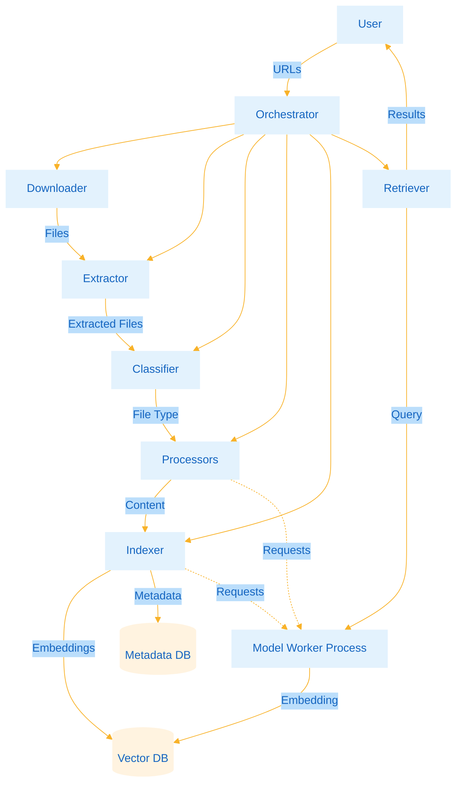

# Architecture

This document describes the design and implementation of The Librarian.

## High-Level Overview



## Core Components

### Orchestrator

**Purpose**: Central coordinator for the entire pipeline  
**Location**: `src/orchestrator.py`

Responsibilities:
- Start and manage the model worker subprocess
- Iterate through URLs from `urls.txt`
- Coordinate download → extract → classify → process → index flow
- Enforce memory discipline (garbage collection after batches)
- Provide search facade via `search(query)`

The orchestrator starts a model server worker on initialization and passes a `ModelClient` instance to all processors and indexers.

### Model Worker Process

**Purpose**: Isolated subprocess that loads AI models once and serves requests  
**Location**: `src/workers/model_server.py`, `src/workers/model_client.py`

**Why separate process?**
- Models stay loaded between queries (no reload overhead)
- Memory isolation prevents fragmentation in main process
- Worker can be restarted independently if it leaks
- Enables request batching for better throughput

**Communication**: Multiprocessing queues (request/response pattern)

**Models loaded**:
- CLIP ViT-B/32 (~600MB) - Image classification
- all-MiniLM-L6-v2 (~90MB) - Text embeddings

**Request types**:
- `clip_description` - Classify an image
- `text_embedding` - Generate embedding for single text
- `text_embedding_batch` - Generate embeddings for multiple texts

### Downloader

**Purpose**: Fetch content from URLs  
**Location**: `src/downloaders/url_downloader.py`

Supports:
- HTTP/HTTPS URLs
- `file://` URLs for local files
- Automatic retry with backoff
- Configurable chunk size for streaming

### Extractor

**Purpose**: Extract files from archives  
**Location**: `src/extractors/zip_extractor.py`

Currently supports:
- ZIP archives (including nested)

Yields files one at a time for memory efficiency.

### Classifier

**Purpose**: Detect file type using magic bytes  
**Location**: `src/classifiers/magic_classifier.py`

Returns:
- `FileType.TEXT` - Plain text files
- `FileType.IMAGE` - PNG, JPEG, GIF, WebP
- `FileType.PDF` - PDF documents
- `FileType.UNKNOWN` - Unsupported formats (skipped)

Uses `python-magic` library (wraps libmagic).

### Processors

**Purpose**: Extract text and generate descriptions from files  
**Location**: `src/processors/`

#### TextProcessor
- Reads plain text files
- UTF-8 decoding with error handling
- Generates simple description from first 200 chars

#### ImageProcessor
- Delegates to model worker for CLIP classification
- Returns description like "a photo of a person (confidence: 0.87)"
- No local model loading

#### PDFProcessor
- Extracts text via PyMuPDF (`fitz`)
- **OCR fallback**: If page has < 50 chars, runs Tesseract
- Redaction detection (blocks covering >80% of page)
- Can use ImageProcessor for OCR on scanned pages

**OCR Optimization**: Checks if PDF already has text layer before invoking OCR. Born-digital PDFs skip OCR entirely.

### Indexer

**Purpose**: Generate and store vector embeddings  
**Location**: `src/indexers/vector_indexer.py`

- Sends text to model worker for embedding generation
- Stores embeddings in vector database (sqlite-vec)
- Supports batch mode for efficiency
- Truncates long texts to 5000 chars

### Retrievers

**Purpose**: Search indexed documents  
**Location**: `src/retrievers/hybrid_retriever.py`

#### ExactMatchRetriever
- FTS5 full-text search on SQLite
- Phrase matching, boolean queries
- Fast for exact term lookups

#### SemanticRetriever
- Vector similarity search using sqlite-vec
- Delegates query embedding to model worker
- Uses cosine distance for ranking
- Converts distance to 0-1 similarity score

#### HybridRetriever (default)
- Dispatches to appropriate retriever based on query
- Heuristic: Quotes or "contains" → exact match
- Everything else → semantic search

## Data Storage

### Metadata Database

**Location**: `/data/database/metadata.db`  
**Technology**: SQLite with FTS5

**Tables**:
- `files` - File metadata (path, URL, type, size, checksum, library_path)
- `content` - Extracted text and descriptions
- `content_fts` - FTS5 virtual table for full-text search
- `processing_state` - URL processing status (for incremental indexing)

### Vector Database

**Location**: `/data/database/vectors.db`  
**Technology**: SQLite with sqlite-vec extension

**Tables**:
- `embeddings` - (file_id, embedding BLOB)

Embeddings stored as little-endian float32 binary format for efficient similarity search.

### File Library

**Location**: `/data/library/`  
**Structure**:
```
library/
├── text/
│   └── a7f3b2c9d8e1f4a5b6c7d8e9f0a1b2c3.txt
├── images/
│   └── f4e5d6c7b8a9f0e1d2c3b4a5c6d7e8f9.jpg
└── pdfs/
    └── e1f2d3c4b5a6e7f8d9c0b1a2c3d4e5f6.pdf
```

Files named by SHA-256 checksum to ensure uniqueness. Original filenames preserved in database for display.

## Processing Pipeline

### Step-by-Step Flow

1. **Download**: `URLDownloader` fetches content to `/data/staging/`
2. **Extract**: If ZIP, `ZipExtractor` yields individual files
3. **Deduplicate**: Calculate SHA-256, skip if checksum exists in DB
4. **Classify**: `MagicByteClassifier` detects file type
5. **Copy to Library**: File copied to `/data/library/{type}/{checksum}.ext`
6. **Process**: Appropriate processor extracts content
   - Text: Direct read
   - Image: CLIP description via model worker
   - PDF: PyMuPDF extraction + OCR fallback
7. **Index**: 
   - Content stored in metadata DB
   - Embedding generated via model worker
   - Embedding stored in vector DB
8. **Cleanup**: Staging files deleted

### Memory Management

- Garbage collection triggered every `BATCH_SIZE` files
- Model worker process isolated from main process
- Files processed one at a time (streaming)
- Long texts truncated to 5000 chars before embedding

## Query Flow

1. User enters query in interactive mode
2. `HybridRetriever` determines search strategy
3. For semantic search:
   - Query sent to model worker for embedding
   - Vector database searched via sqlite-vec
   - Top-k results retrieved by cosine distance
   - Results hydrated with metadata from main DB
4. Results filtered by threshold (default 0.25)
5. Formatted table displayed with Ms. Clarke's commentary

## Model Caching Strategy

**Build Time**:
- Environment variables set: `HF_HOME`, `TRANSFORMERS_CACHE`, etc.
- Models downloaded to `/opt/hf_cache/`
- Cache copied from builder stage to runtime stage

**Runtime**:
- Same environment variables point to cached location
- `HF_HUB_OFFLINE=1` prevents any network attempts
- Models loaded once in worker subprocess
- No downloads, completely offline operation

## Configuration

All settings in `.env` file:
- Processing batch size
- OCR enable/disable
- Model selection
- Path overrides
- Resource limits

See [Configuration](configuration.md) for full reference.

## Design Decisions

### Why SQLite?

- Single-file databases (easy backup)
- No separate database server needed
- FTS5 is fast and mature for full-text search
- sqlite-vec good enough for ~200k vectors on 4GB RAM
- ACID guarantees for reliability

### Why Process Isolation?

- PyTorch models fragment memory when loaded/unloaded
- Keeping models in separate process prevents fragmentation
- Worker can be killed/restarted without affecting main process
- Easier to monitor and debug model-related issues

### Why Checksum Filenames?

- Guarantees uniqueness (no collisions)
- Enables deduplication across different source URLs
- Immutable once written (safe for concurrent access)
- Original filename preserved in DB for display

### Why Not FAISS/Pinecone/Weaviate?

- sqlite-vec is simpler (no separate service)
- Good enough performance for target scale
- Atomic backups (everything in SQLite files)
- Reduced operational complexity
- Can migrate later if needed

## Performance Characteristics

**Processing Speed** (approximate):
- Text files: ~100-200/second
- Images: ~5-10/second (CLIP inference)
- Born-digital PDFs: ~10-20/second
- Scanned PDFs: ~1-2 pages/second (OCR bottleneck)

**Query Speed**:
- Exact match (FTS5): < 10ms for thousands of docs
- Semantic search: ~50-100ms for 10k vectors
- Scales roughly linearly with document count

**Memory Usage**:
- Base: ~1.5GB (models loaded)
- Processing: +500MB-1GB (peaks during batches)
- Querying: ~1.5GB (mostly models)

## Extension Points

To add support for new file types:

1. Create processor in `src/processors/`
2. Implement `AbstractProcessor` interface
3. Register in `Orchestrator._processors` list
4. Update classifier if needed

To use different models:

1. Update `.env`: `EMBEDDING_MODEL`, `VISION_MODEL`
2. Rebuild image to download new models
3. Ensure model worker handles new model types

To add new search strategies:

1. Create retriever in `src/retrievers/`
2. Implement `AbstractRetriever` interface
3. Wire into `HybridRetriever` logic